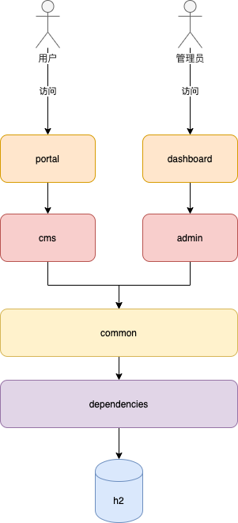

# rising-waves-v1.png02-项目简介

## 项目地址

[开发文档](https://yookoo.github.io/rising-waves/)

[Github]()

## 名字由来

这是一个后端管理系统，项目命名借鉴了B站2020年五四青年节推出的演讲视频。 其中"后"寓意后端管理系统，"后浪"也希望我们年轻一代有更好的未来。

当然，一分耕耘一分收获， 美好的未来也不是说说就能来的，还是要靠脚踏实地，一步一个脚印，所以有了本项目。 本项目参考了多个开源项目，一方面可以巩固我所学的知识，另一方面也可以给大家一个可参考的案例。 如果你觉得对你有帮助，请多多 Star ,谢谢大家支持。

## 架构图

这是这个项目目前的计划，一共有6个模块，其中有4个Java模块，2个前台Vue模块。因为我是Java程序员，前端的模块我就不从零开始了，计划是从目前的开源项目[vue-element-admin](https://panjiachen.github.io/vue-element-admin/#/dashboard) 或者是 [Ant-desgin-Pro的vue版](https://preview.pro.antdv.com/dashboard/workplace)中选择一个，我个人是比较倾向于Ant-desgin-Pro的vue版因为他是可以控制菜单位置的，我们把菜单位置移动到顶部，就比较像是一个门户系统，移动到左侧，就像是一个后台管理的系统。

## 分享方式

这个课程我主要还是代码先写好，然后给大家讲代码的方式分享，因为，现场代码节奏太慢，视频又臭又长，肯定没有人愿意看了，因为每一行代码都是要经过反复修改的，有时候几个小时才写几百行代码，大家如果觉得有问题及时的提出来，我及时会改正，争取把代码做到最好。

## 更新计划

每周至少更新一集。

代码编写的日志我也会写在record里面，让大家了解项目的开发进度。

## 如何学习开源项目

[如何学习开源项目](https://www.bilibili.com/read/cv6536430)

