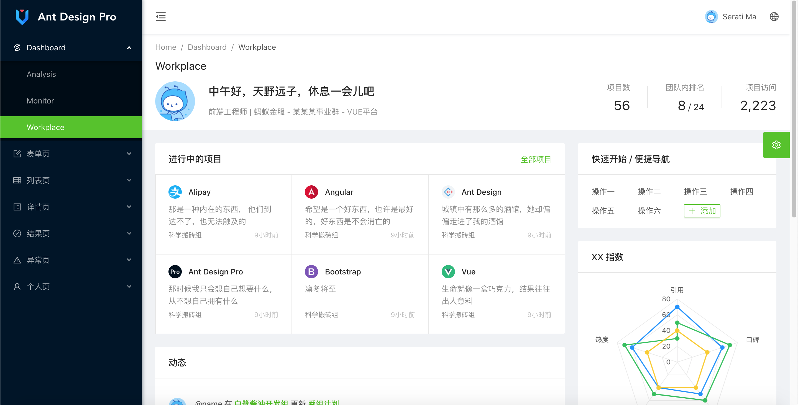

# 搭建项目框架


## 项目架构图


## 创建父工程

rising-waves

## 创建jar包版本管理项目

rising-waves-dependencies

为什么要有这个工程？

这个工程的作用是什么？


## 创建Common公共依赖

rising-waves-common


## 创建Admin工程

rising-waves-admin


## 创建Dashboard工程

rising-waves-dashboard

[ant-design-pro-vue文档](https://pro.antdv.com/docs/getting-started)

### 下载源代码

```shell
git clone --depth=1 https://github.com/sendya/ant-design-pro-vue.git rising-waves-dashboard

Cloning into 'rising-waves-dashboard'...
remote: Enumerating objects: 308, done.
remote: Counting objects: 100% (308/308), done.
remote: Compressing objects: 100% (284/284), done.
remote: Total 308 (delta 13), reused 144 (delta 3), pack-reused 0
Receiving objects: 100% (308/308), 415.18 KiB | 5.00 KiB/s, done.
Resolving deltas: 100% (13/13), done.
```

### 进入工作区

```shell
cd rising-waves-dashboard 
```


### 安装依赖

```shell
npm install

npm WARN deprecated chokidar@2.1.8: Chokidar 2 will break on node v14+. Upgrade to chokidar 3 with 15x less dependencies.
npm WARN deprecated core-js@2.6.11: core-js@<3 is no longer maintained and not recommended for usage due to the number of issues. Please, upgrade your dependencies to the actual version of core-js@3.
npm WARN deprecated left-pad@1.3.0: use String.prototype.padStart()

> fsevents@1.2.13 install /Users/apple/mycode/workspaces/yookoo/rising-waves-dashboard/node_modules/jest-haste-map/node_modules/fsevents
> node install.js

  SOLINK_MODULE(target) Release/.node
  CXX(target) Release/obj.target/fse/fsevents.o
  SOLINK_MODULE(target) Release/fse.node

> fsevents@1.2.13 install /Users/apple/mycode/workspaces/yookoo/rising-waves-dashboard/node_modules/watchpack-chokidar2/node_modules/fsevents
> node install.js

  SOLINK_MODULE(target) Release/.node
  CXX(target) Release/obj.target/fse/fsevents.o
  SOLINK_MODULE(target) Release/fse.node

> fsevents@1.2.13 install /Users/apple/mycode/workspaces/yookoo/rising-waves-dashboard/node_modules/webpack-dev-server/node_modules/fsevents
> node install.js

  SOLINK_MODULE(target) Release/.node
  CXX(target) Release/obj.target/fse/fsevents.o
  SOLINK_MODULE(target) Release/fse.node

> yorkie@2.0.0 install /Users/apple/mycode/workspaces/yookoo/rising-waves-dashboard/node_modules/yorkie
> node bin/install.js

setting up Git hooks
done


> core-js@2.6.11 postinstall /Users/apple/mycode/workspaces/yookoo/rising-waves-dashboard/node_modules/babel-polyfill/node_modules/core-js
> node -e "try{require('./postinstall')}catch(e){}"

Thank you for using core-js ( https://github.com/zloirock/core-js ) for polyfilling JavaScript standard library!

The project needs your help! Please consider supporting of core-js on Open Collective or Patreon: 
> https://opencollective.com/core-js 
> https://www.patreon.com/zloirock 

Also, the author of core-js ( https://github.com/zloirock ) is looking for a good job -)


> core-js@2.6.11 postinstall /Users/apple/mycode/workspaces/yookoo/rising-waves-dashboard/node_modules/babel-runtime/node_modules/core-js
> node -e "try{require('./postinstall')}catch(e){}"


> core-js@3.6.5 postinstall /Users/apple/mycode/workspaces/yookoo/rising-waves-dashboard/node_modules/core-js
> node -e "try{require('./postinstall')}catch(e){}"


> ejs@2.7.4 postinstall /Users/apple/mycode/workspaces/yookoo/rising-waves-dashboard/node_modules/ejs
> node ./postinstall.js

Thank you for installing EJS: built with the Jake JavaScript build tool (https://jakejs.com/)


> ant-design-vue@1.6.0 postinstall /Users/apple/mycode/workspaces/yookoo/rising-waves-dashboard/node_modules/ant-design-vue
> node scripts/postinstall || echo "ignore"

Thank you for using ant-design-vue ( https://github.com/vueComponent/ant-design-vue )!

The project needs your help! Please consider supporting of ant-design-vue on Open Collective or Patreon: 🙏
> https://opencollective.com/ant-design-vue 
> https://www.patreon.com/tangjinzhou 

更多赞助方式(支付宝、微信、Paypal)请查看如下链接: 🙏
> https://www.antdv.com/docs/vue/sponsor-cn 

Ant Design Vue 官方网站: 
> https://www.antdv.com/ 

npm notice created a lockfile as package-lock.json. You should commit this file.
npm WARN notsup Unsupported engine for watchpack-chokidar2@2.0.0: wanted: {"node":"<8.10.0"} (current: {"node":"12.16.3","npm":"6.14.4"})
npm WARN notsup Not compatible with your version of node/npm: watchpack-chokidar2@2.0.0
npm WARN jsdom@15.2.1 requires a peer of canvas@^2.5.0 but none is installed. You must install peer dependencies yourself.
npm WARN ws@7.3.0 requires a peer of bufferutil@^4.0.1 but none is installed. You must install peer dependencies yourself.
npm WARN ws@7.3.0 requires a peer of utf-8-validate@^5.0.2 but none is installed. You must install peer dependencies yourself.

added 1881 packages from 1193 contributors in 89.3s

47 packages are looking for funding
  run `npm fund` for details

```


>   **注意**：如果依赖下载失败可以设置淘宝的源

```shell
npm config set registry https://registry.npm.taobao.org

或者临时使用淘宝源

npm install --registry https://registry.npm.taobao.org 
```


使用`npm config list`可以查看自己的npm的配置，下面是我的配置的信息。

```shell
➜  rising-waves-dashboard git:(refactor/pro-v3) ✗ npm config list
; cli configs
metrics-registry = "https://registry.npm.taobao.org/"
scope = ""
user-agent = "npm/6.14.4 node/v12.16.3 darwin x64"

; userconfig /Users/apple/.npmrc
registry = "https://registry.npm.taobao.org/"

; node bin location = /usr/local/bin/node
; cwd = /Users/apple/mycode/workspaces/yookoo/rising-waves-dashboard
; HOME = /Users/apple
; "npm config ls -l" to show all defaults.
```


### 启动项目

```bash
npm run serve

> vue-antd-pro@3.0.0 serve /Users/apple/mycode/workspaces/yookoo/rising-waves-dashboard
> vue-cli-service serve

VUE_APP_PREVIEW true
 INFO  Starting development server...
95% emitting ThemeColorReplacerExtracted theme color css content length: 28644
98% after emitting CopyPlugin

 DONE  Compiled successfully in 26504ms                                 13:35:25


  App running at:
  - Local:   http://localhost:8000/ 
  - Network: http://192.168.0.109:8000/
```


启动完成后，打开浏览器访问 [http://localhost:8000](http://localhost:8080/)，你看到下面的页面就代表成功了。


### 登录

输入账号密码 admin/admin ，进入Dashboard。




## 创建内容管理（CMS）工程

rising-waves-cms


## 创建门户（Portal）工程

rising-waves-portal

