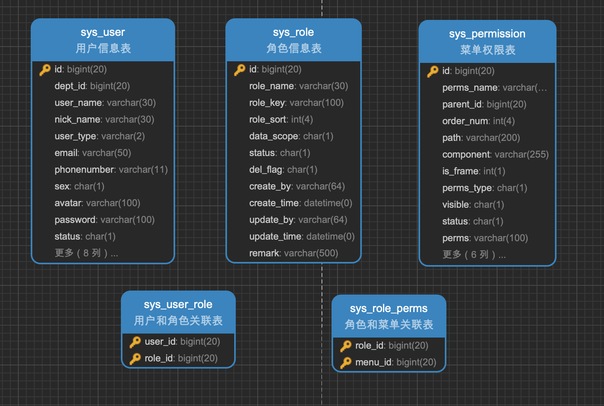

# 数据库设计

## RBAC模型设计




## 数据库设计规范

[数据库设计规范](../standard/sql-standard.md)


## 数据库SQL


```sql

SET NAMES utf8mb4;
SET FOREIGN_KEY_CHECKS = 0;


-- ----------------------------
-- Table structure for sys_user
-- ----------------------------
DROP TABLE IF EXISTS `sys_user`;
CREATE TABLE `sys_user` (
  `id` bigint(20) NOT NULL AUTO_INCREMENT COMMENT '用户ID',
  `dept_id` bigint(20) DEFAULT NULL COMMENT '部门ID',
  `user_name` varchar(30) NOT NULL COMMENT '用户账号',
  `nick_name` varchar(30) NOT NULL COMMENT '用户昵称',
  `user_type` tinyint(2) DEFAULT 0 COMMENT '用户类型 (0系统用户）',
  `email` varchar(50) DEFAULT '' COMMENT '用户邮箱',
  `telephone` varchar(11) DEFAULT '' COMMENT '手机号码',
  `sex` tinyint(2) DEFAULT 0 COMMENT '用户性别（0未知 1男 2女）',
  `avatar` varchar(100) DEFAULT '' COMMENT '头像地址',
  `password` varchar(100) DEFAULT '' COMMENT '密码',
  `status` tinyint(2) DEFAULT 0 COMMENT '帐号状态（0正常 1停用）',
  `deleted` tinyint(1) DEFAULT '0' COMMENT '删除标志（0代表存在 1代表删除）',
  `login_ip` varchar(50) DEFAULT '' COMMENT '最后登陆IP',
  `login_time` datetime DEFAULT NULL COMMENT '最后登陆时间',
  `create_by` varchar(64) DEFAULT '' COMMENT '创建者',
  `create_time` datetime DEFAULT NULL COMMENT '创建时间',
  `update_by` varchar(64) DEFAULT '' COMMENT '更新者',
  `update_time` datetime DEFAULT NULL COMMENT '更新时间',
  `remark` varchar(500) DEFAULT NULL COMMENT '备注',
  PRIMARY KEY (`id`) USING BTREE
) ENGINE=InnoDB AUTO_INCREMENT=10000 DEFAULT CHARSET=utf8mb4 ROW_FORMAT=DYNAMIC COMMENT='用户信息表';

-- ----------------------------
-- Records of sys_user
-- ----------------------------
BEGIN;
COMMIT;


-- ----------------------------
-- Table structure for sys_role
-- ----------------------------
DROP TABLE IF EXISTS `sys_role`;
CREATE TABLE `sys_role` (
  `id` bigint(20) NOT NULL AUTO_INCREMENT COMMENT '角色ID',
  `role_name` varchar(30) NOT NULL COMMENT '角色名称',
  `role_key` varchar(100) NOT NULL COMMENT '角色权限字符串',
  `sorted` int(4) NOT NULL COMMENT '显示顺序',
  `data_scope` int(4) DEFAULT 1 COMMENT '数据范围（1：全部数据权限 2：自定数据权限 3：本部门数据权限 4：本部门及以下数据权限）',
  `deleted` tinyint(1) DEFAULT 0 COMMENT '删除标志（0代表存在 1代表删除）',
  `create_by` varchar(64) DEFAULT '' COMMENT '创建者',
  `create_time` datetime DEFAULT NULL COMMENT '创建时间',
  `update_by` varchar(64) DEFAULT '' COMMENT '更新者',
  `update_time` datetime DEFAULT NULL COMMENT '更新时间',
  `remark` varchar(500) DEFAULT NULL COMMENT '备注',
  PRIMARY KEY (`id`) USING BTREE
) ENGINE=InnoDB AUTO_INCREMENT=10000 DEFAULT CHARSET=utf8mb4 ROW_FORMAT=DYNAMIC COMMENT='角色信息表';

-- ----------------------------
-- Records of sys_role
-- ----------------------------
BEGIN;
COMMIT;


-- ----------------------------
-- Table structure for sys_permission
-- ----------------------------
DROP TABLE IF EXISTS `sys_permission`;
CREATE TABLE `sys_permission` (
  `id` bigint(20) NOT NULL AUTO_INCREMENT COMMENT '权限ID',
  `perms_name` varchar(50) NOT NULL COMMENT '权限名称',
  `perms` varchar(100) DEFAULT NULL COMMENT '权限标识',
  `parent_id` bigint(20) DEFAULT 0 COMMENT '父权限ID',
  `sorted` int(4) DEFAULT 0 COMMENT '显示顺序',
  `path` varchar(200) DEFAULT '' COMMENT '路由地址',
  `component` varchar(255) DEFAULT NULL COMMENT '组件路径',
  `external_link` tinyint(1) DEFAULT 0 COMMENT '是否为外链（0是 1否）',
  `perms_type` tinyint(2) DEFAULT 0 COMMENT '权限类型（0 未知 1菜单 2按钮 3 目录）',
  `visible` tinyint(1) DEFAULT 0 COMMENT '显示状态（1显示 0隐藏）',
  `deleted` tinyint(1) DEFAULT 0 COMMENT '权限状态（0正常 1删除）',
  `icon` varchar(100) DEFAULT '#' COMMENT '菜单图标',
  `create_by` varchar(64) DEFAULT '' COMMENT '创建者',
  `create_time` datetime DEFAULT NULL COMMENT '创建时间',
  `update_by` varchar(64) DEFAULT '' COMMENT '更新者',
  `update_time` datetime DEFAULT NULL COMMENT '更新时间',
  `remark` varchar(500) DEFAULT '' COMMENT '备注',
  PRIMARY KEY (`id`) USING BTREE
) ENGINE=InnoDB AUTO_INCREMENT=10000 DEFAULT CHARSET=utf8mb4 ROW_FORMAT=DYNAMIC COMMENT='菜单权限表';

-- ----------------------------
-- Records of sys_permission
-- ----------------------------
BEGIN;
COMMIT;


-- ----------------------------
-- Table structure for sys_role_perms
-- ----------------------------
DROP TABLE IF EXISTS `sys_role_perms`;
CREATE TABLE `sys_role_perms` (
  `role_id` bigint(20) NOT NULL COMMENT '角色ID',
  `menu_id` bigint(20) NOT NULL COMMENT '菜单ID',
  PRIMARY KEY (`role_id`,`menu_id`) USING BTREE
) ENGINE=InnoDB DEFAULT CHARSET=utf8mb4 ROW_FORMAT=DYNAMIC COMMENT='角色和菜单关联表';

-- ----------------------------
-- Records of sys_role_perms
-- ----------------------------
BEGIN;
COMMIT;


-- ----------------------------
-- Table structure for sys_user_role
-- ----------------------------
DROP TABLE IF EXISTS `sys_user_role`;
CREATE TABLE `sys_user_role` (
  `user_id` bigint(20) NOT NULL COMMENT '用户ID',
  `role_id` bigint(20) NOT NULL COMMENT '角色ID',
  PRIMARY KEY (`user_id`,`role_id`) USING BTREE
) ENGINE=InnoDB DEFAULT CHARSET=utf8mb4 ROW_FORMAT=DYNAMIC COMMENT='用户和角色关联表';

-- ----------------------------
-- Records of sys_user_role
-- ----------------------------
BEGIN;
COMMIT;

SET FOREIGN_KEY_CHECKS = 1;

 
```


 